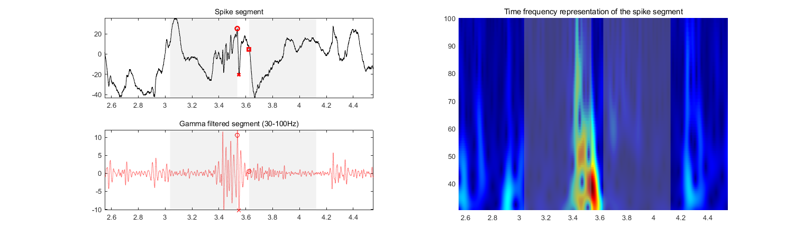

# Spike-Gamma

The spike-gamma implemntation steps are as follows:

1. Run Janca spike detector and get spike peak locations for a single bipolar SEEG channel. (spike_detector_hilbert_v25.m)
2. Run postprocessing code on the spike detections to remove artefacts and spindles. (postprocessing.m)
3. 

Cite this paper

