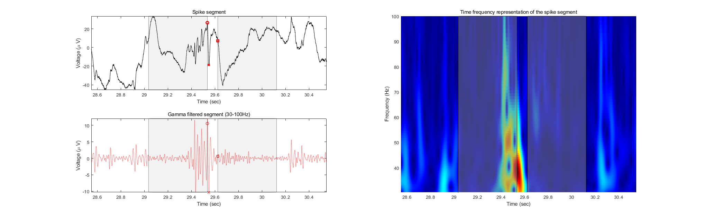

# Spike-Gamma

The spike-gamma implemntation steps are as follows:

1.Run the Janca spike detector to obtain spike peak locations for a single bipolar SEEG channel. (spike_detector_hilbert_v25.m)
2. Apply postprocessing code to the spike detections, removing artifacts and spindles. (postprocessing.m)
3. Extract the spike for each detection as a 300 ms segment filtered between [0.3 500] Hz, and determine the onset (P1) and end (N2) points of the spike. (compute_spike_boundary.m)
4. Utilize these boundaries to extract a 2000 ms segment filtered between [30 100] Hz, and determine if there is preceding gamma activity before the spike. (compute_gamma.m)
5. For each spike, generate a 3-element array consisting of the maximum gamma power, the corresponding gamma frequency, and the duration of the gamma activity in milliseconds. If no gamma activity is detected, the array returns [0, 0, 0].
6. Repeat steps 3-5 for each spike, and calculate the spike-gamma location and event rates.

An example of the spike-gamma is given below:

Please provide appropriate credits:

